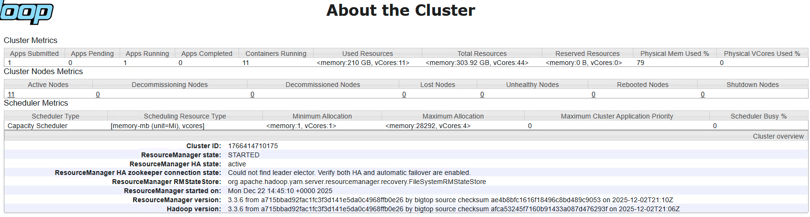
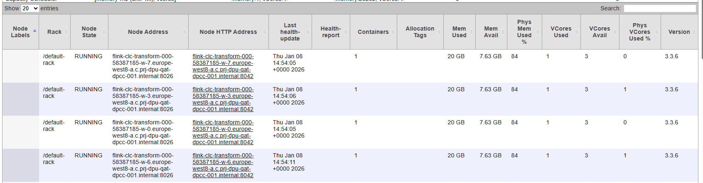
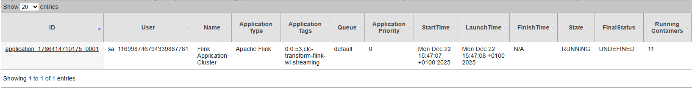
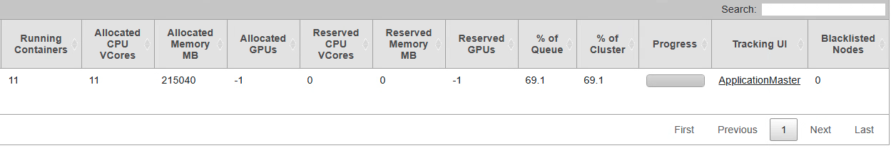
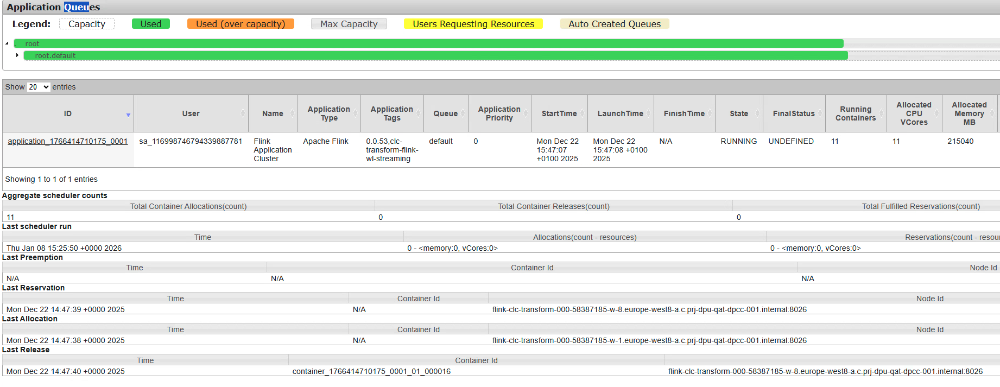
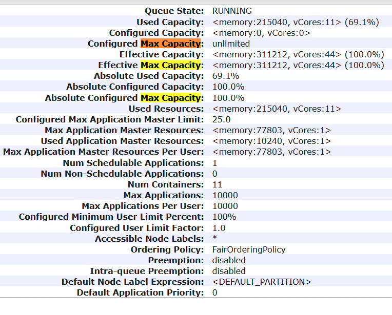

# 0. The Theory 

## What is YARN?

Think of YARN as the **Operating System** of a data cluster.

* **The Resource Manager (RM):** The ultimate authority that mediates resources among all applications.
* **The Node Manager (NM):** The agent on each machine that monitors resource usage (CPU, Memory) and reports back to the RM.
* **Containers:** The basic unit of resource. When you run a job, YARN carves out a "Container" (e.g., 2GB RAM, 1 vCore) for a task to run in.

## The NodeManager & Heartbeats

The **NodeManager** is a per-machine agent. It has two primary jobs:

* **Container Management:** It launches, monitors, and eventually kills the containers (the tasks) assigned to it by the Resource Manager.
* **Heartbeating:** Every few seconds, the NM sends a "heartbeat" to the Resource Manager. This heartbeat contains the status of the machine's resources. If a heartbeat is missed for too long, the Resource Manager marks the node as **Lost**.

## The ApplicationMaster (AM)

When you submit a job, YARN doesn't just run your code. It follows this workflow:

* **The First Container:** YARN launches a special container called the **ApplicationMaster** (AM).
* **Negotiation:** The AM acts as the "manager" for that specific job. It talks to the Resource Manager (RM) to ask for more containers to do the actual work.
* **Execution:** Once it gets those containers, it coordinates the tasks (the worker nodes) and reports progress back to the RM.

## Capacity Scheduler

Your cluster is using the **Capacity Scheduler**. In YARN theory, this scheduler is designed for multi-tenancy—allowing many organizations to share one large cluster while ensuring each gets a "guaranteed" slice of resources.

* **Queues:** Resources are divided into a hierarchy of queues.
* **Elasticity:** If one queue is idle, other queues can "borrow" its resources. However, if the original owner needs them back, the scheduler can perform Preemption (killing tasks to reclaim space).
* **The Root Queue:** Every cluster has a root queue, which is the parent of all other queues.

# 1. About the Cluster

### A. Cluster Metrics (The "Workload" View)

This tells you how busy the cluster is right now.

* **Apps Running (1):** You have one active job.
* **Containers Running (11):** That single job has spawned 11 containers across your cluster.
* Used Resources vs. Total Resources: 
    * **Memory:** You are using 210 GB out of 303.92 GB. That’s about 69% of your RAM.
    * **vCores:** You are using 11 out of 44. That’s only 25% of your CPU capacity.
    * **Insight:** Your current job is Memory-Intensive. You will run out of RAM long before you run out of CPU power.*

### B. Cluster Nodes Metrics (The "Hardware" View)

* **Active Nodes (11):** You have 11 machines currently talking to the Resource Manager.
* **Lost/Unhealthy Nodes (0):** This is great. "Lost" nodes usually mean network issues or crashes; "Unhealthy" usually means a disk is full on a worker node.

### C. Scheduler Metrics (The "Traffic Control" View)

Your cluster uses the **Capacity Scheduler**. This is designed to allow multiple organizations to share a cluster.

* **Max Allocation (<memory: 28292, vCores: 4>):** This is a critical "guardrail." It means no single container can ever ask for more than ~28GB of RAM or 4 cores. If a job needs 32GB for a single task, it will fail.

### D. The "Red Flag" in your Screenshot

Look at the **ResourceManager HA (High Availability)** section:

`Could not find leader elector. Verify both HA and automatic failover are enabled.`

In a production environment, you usually have two Resource Managers (Active and Standby). If the Active one dies, the Standby takes over. This error suggests that ZooKeeper (the coordinator) isn't correctly configured to handle that "failover." If your current RM process crashes, your whole cluster will go down because there is no "leader election" happening.

### E. Pro-Tip for your Learning:

Notice that you have **11 Nodes** and **11 Containers** running. This suggests YARN has placed exactly one container on each node. This is a very "balanced" load, which is ideal for performance!

# 2. About the Nodes

### A. Deep Dive into your Node Metrics

| Column               | What it tells you                         | Analysis of your Cluster                                                                 |
|----------------------|-------------------------------------------|------------------------------------------------------------------------------------------|
| Rack                 | Physical location of the server            | All nodes are in `/default-rack`. This means no "Rack Awareness" is configured, which is common in cloud environments. |
| Node State           | The health status                          | RUNNING. This is perfect. Other states include UNHEALTHY (often due to disk failure) or DECOMMISSIONING. |
| Containers           | Tasks running on this specific node        | 1. Your 11 containers are perfectly distributed (1 per node). This is known as high "data locality" potential. |
| Mem Used / Avail     | YARN-managed RAM                          | 20 GB Used / 7.63 GB Avail. This node has roughly 28 GB total dedicated to YARN.           |
| Phys Mem Used %      | The actual RAM usage of the OS             | 84%. Note: This is higher than the YARN-allocated memory. This means the OS and other background processes are using significant RAM outside of YARN. |
| VCores Used / Avail  | CPU "Slices"                              | 1 Used / 3 Avail. Each node has 4 vCores total. You are barely using any CPU.              |

### B. Key Insights for your Knowledge Base

#### **The "Memory-Heavy" Pattern**

Notice that your **Phys Mem** Used % is **84%**, but your **Phys VCores** Used % is **0%** or **1%**.

* **The Lesson:** Your current workload (likely a Spark or Flink job, based on the node names) is consuming memory to hold data but isn't doing heavy mathematical calculations at this exact moment.
* **The Risk:** If Phys Mem Used % hits 90-95%, the Linux kernel might trigger the "OOM (Out of Memory) Killer," which could crash your NodeManager process.

#### **Resource Allocation vs. Physical Reality**
In YARN, there is a difference between Allocated and Physical resources:

* **Allocated:** What YARN "thinks" is being used based on the job request (e.g., "Give me 20GB").
* **Physical:** What the hardware is actually feeling.

    **Knowledge Note:** If Physical usage is much higher than Allocated, it usually means your containers are "leaking" memory or the overhead of the Java Virtual Machine (JVM) is larger than expected.

### C. Troubleshooting Checklist
When you look at this page in the future, watch out for these "Red Flags":

* **Skewed Containers:** One node having 10 containers while others have 0. This indicates a "Hot Partition" where one node is doing all the work.
* **Last Health-Update:** If this timestamp is more than a minute old, the node is likely about to be marked as "Lost."
* **Unhealthy Report:** If a node state changes, check the "Health-report" column; it usually says "1/1 local-dirs are bad," which means the hard drive is full.

# 3. About the Application

The "Applications" view (shown in your third and fourth screenshots) is the most critical page for monitoring specific workloads. While the previous views showed the hardware status, this view shows the software consuming those resources.

In YARN theory, an Application is a single job submitted to the cluster.

### A. Identity & Lifecycle

* **Application ID** (`application_1766414710175_0001`): * The first long number is the cluster timestamp (when the RM started).
    * The second part (`0001`) is a monotonic counter showing this was the first application submitted since the RM started.
* **State** (`RUNNING`): The job is currently active and processing data.
* **FinalStatus** (`UNDEFINED`): Don't be alarmed by "Undefined." In YARN, this simply means the job is still running. It will only change to SUCCEEDED, FAILED, or KILLED once the application finishes and unregisters from the RM.
* **Start Time:** This job has been running since Dec 22. Because Flink is a stream-processing engine, it is normal for these applications to run indefinitely (long-lived jobs).

### B. Resource Consumption

* **Running Containers (11):** This matches your node view perfectly. You have 1 ApplicationMaster container + 10 Worker containers (one per node).
* **Allocated Memory MB (215,040 MB):** This application is using ~210 GB of RAM.
* **% of Cluster (69.1%):** This single job is taking up nearly 70% of your total cluster RAM.
* **Allocated vCores (11):** Each of the 11 containers is using exactly 1 CPU core.

### C. Critical Knowledge: The "Tracking UI"

In your fourth screenshot, there is a link under **Tracking UI** called `ApplicationMaster`.

 * **Knowledge Note:** Clicking this link takes you out of YARN and into the Flink Web Dashboard.
* **Why it matters:** YARN only knows "I gave this job 11 containers." It doesn't know if the job is actually processing 1 million records or if it's stuck in an infinite loop. You must use the Tracking UI to see internal application metrics like "Backpressure" or "Checkpointing status".

# 4. About the Scheduler

### A. The Queue Hierarchy (The Progress Bars)

At the top, you see two green bars: `root` and `root.default`.

* `root`: This represents 100% of your cluster's potential.
* `root.default`: This is where your Flink job is running.
* **Insight:** Since the bar is entirely green, it means your current job is filling the allocated capacity of that queue. The legend indicates that Green means "Used" capacity.

### B. Aggregate Scheduler Counts

This section tracks the "churn" of the cluster since the Resource Manager started:

* **Total Container Allocations (11):** YARN has successfully handed out 11 containers to your application.
* **Total Container Releases (0):** No containers have been finished or killed yet. This makes sense for a Flink "streaming" job, which is meant to run forever.

### C. The "Last" Events (The Paper Trail)

This is a log of the most recent decisions the scheduler made:

* **Last Allocation:** This shows exactly when and where the last container was granted. For your cluster, the last allocation happened on Dec 22 on node `...-w-1`.
* **Last Reservation:** If a large container cannot fit anywhere, the scheduler "reserves" a node for it. Your screenshot shows `Last Reservation` as `N/A`, meaning the cluster is healthy and containers are fitting without needing to wait for space to clear.

# 5. Key Takeaway for Future Projects

In a larger project with multiple teams (e.g., Data Science, Marketing, Engineering), you would see more bars under `root`.

If you see an **Orange bar**, it means a queue is "Used (over capacity)". This is fine if the cluster is quiet, but those jobs are the first ones YARN will kill if another team submits a high-priority job.

The **Yellow bar** ("Users Requesting Resources") is a warning sign; it means users are asking for more than the queue is currently allowed to give.